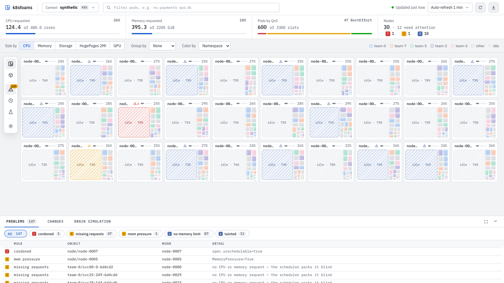
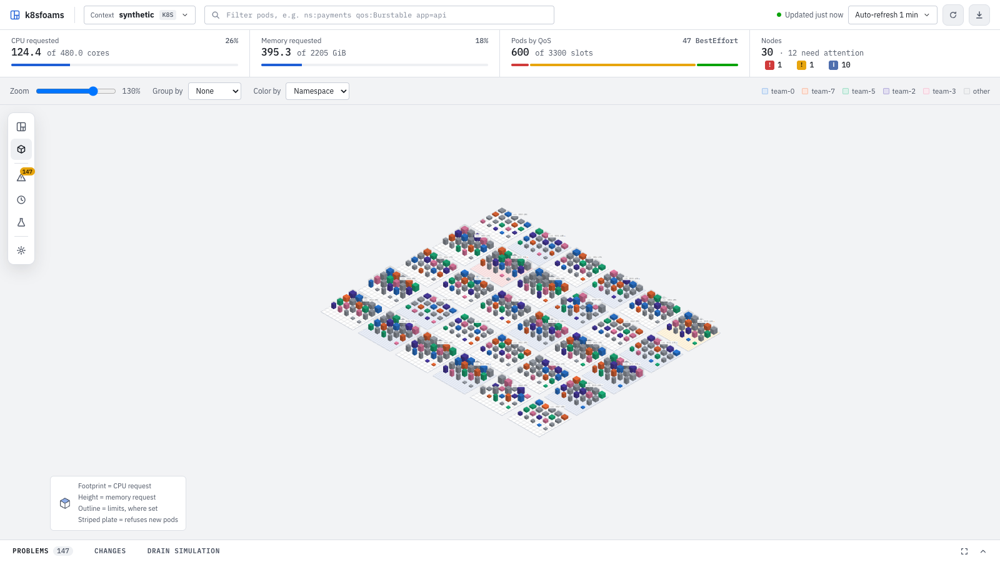

# k8s-pod-foamtree

<p align="center">
  
</p>

> Go implementation of [mmpyro/k8s-pod-foamtree](https://github.com/mmpyro/k8s-pod-foamtree).

**k8sfoams** is a read-only dashboard that answers one question: *where is my cluster's requested CPU and memory actually going, and how much room is left on each node?*

It visualizes **resource requests** — what the scheduler reserves — not live usage. That makes it a tool for spotting over-requesting pods and idle headroom, not a performance monitor. It is one static Go binary with the UI embedded. Run it on your laptop against *~/.kube/config* (or `$KUBECONFIG`), or inside the cluster behind built-in OIDC sign-in. It needs no metrics-server.

## How it works

1. Keeps a watch cache of nodes (`status.capacity`) and all non-terminated pods per kubeconfig context, started on the first request for that context — a refresh reads memory and never LISTs the API server. Pods in `Succeeded`/`Failed` are excluded — they still report requests via the API but no longer reserve anything.
2. Normalizes CPU to millicores and memory to decimal kB with Kubernetes' own quantity parser. A pod's **effective request** is the scheduler's formula (`k8s.io/component-helpers` `PodRequests`): regular containers and native sidecars (init containers with `restartPolicy: Always`) are summed, plain init containers run one at a time so the largest of them is maxed against that sum, and pod overhead and pod-level resources are added.
3. Nests the result node → pod → container and adds a synthetic `empty` child per node for free capacity, then serves it as JSON.
4. A React single-page app, compiled at build time by `go tool esbuild` and embedded in the binary together with React's production build — nothing loads from a CDN. It fetches CPU and memory in parallel, merges them, and renders. The view auto-refreshes every 60 seconds by default.

## 2D map



A squarified treemap. Each node is a square box, each pod is a foam inside it. A pod with more than one container is split into sub-foams. The empty foam is unused (free) capacity on that node. Pick **CPU** or **Memory** with **Size by** in the toolbar; **Group by** boxes the nodes by zone, region, pool, instance type or capacity type — see [Topology](#topology). Nodes that offer GPUs, ephemeral storage or hugepages add them to that control: the map then sizes nodes and pods by that resource, nodes without it drop out, and the node overlay shows how much of each is requested.

## 3D view



A WebGL (Three.js) scene: one plate per node, one cube per pod. A cube encodes both resources at once:

- **width × depth** (footprint) → CPU request
- **height** → memory request
- **color** → namespace, or the pod's QoS class or audit findings with **Color by** (QoS, Problems)
- **translucent shell** → the pod's limits, grown only on the axes that have one (footprint from the CPU limit, height from the memory limit). A pod without a limit on an axis has no ceiling to draw there.

Both dimensions are square-root scaled, so a 10× larger pod is not 10× wider. Because a cube already shows both resources, the **Size by** control is replaced in 3D by a **Zoom** slider. Drag to orbit, scroll to zoom; hover a pod for its requests and limits, click it to pin its workload, click a plate to open the node.

**Group by** splits the plates into framed blocks — see [Topology](#topology). On refresh, new pods grow in and removed ones shrink out; the camera stays where you left it unless nodes join or leave.

Switch views with the Map and 3D buttons on the rail at the map's left edge. Frames render only when something changes, so an idle dashboard costs nothing. Without WebGL, a notice points to the 2D map.

## Topology

**Group by** in the toolbar — None, Zone, Region, Pool, Type or Capacity — frames the nodes of each availability zone, region, node pool, instance type or capacity type (spot vs on-demand): in the 2D map as a box of node cards sized by the group's total capacity, in the 3D scene as a block of plates on a shared floor. Each group's label reads its name, node count and the requested share of its capacity (the selected resource in 2D, the tighter one in 3D), so a zone or pool running hotter than its siblings stands out.

| Group by | Node label |
| --- | --- |
| Zone | `topology.kubernetes.io/zone` |
| Region | `topology.kubernetes.io/region` |
| Pool | first of `karpenter.sh/nodepool`, `eks.amazonaws.com/nodegroup`, `cloud.google.com/gke-nodepool`, `kubernetes.azure.com/agentpool` |
| Type | `node.kubernetes.io/instance-type` |
| Capacity | `spot` or `on-demand`, from the first of `karpenter.sh/capacity-type`, `eks.amazonaws.com/capacityType` (`SPOT`/`ON_DEMAND`), `cloud.google.com/gke-spot=true` or `cloud.google.com/gke-provisioning=spot`, `kubernetes.azure.com/scalesetpriority` (`spot`/`regular`) |

A node without the label goes to its own group, `no zone`, `no pool`, and so on.

## Controls

- **Memory unit**: MiB, GiB (default), or TiB, under Settings on the rail.
- **Size by**: CPU or Memory, in the toolbar (in 3D, a **Zoom** slider takes its place).
- **Color by**: in the toolbar. *Namespace* (default) colors each pod by its namespace; *QoS* by its QoS class (see [QoS & eviction risk](#qos--eviction-risk)); *Problems* by the severity of its audit findings. A legend sits beside it.
- **Context**: the context picker in the top bar lists every context from your kubeconfig, in kubeconfig order, the active one checked, tagged by provider. **Switching only changes the context inside the k8sfoams web server — your ~/.kube/config file is never modified.**
- **Refresh**: the Auto-refresh menu in the top bar (Off, 15 s … 10 min), plus a *Refresh now* button beside it.
- **Filter**: the query bar in the top bar highlights matching pods and dims the rest — nothing is removed from the view. See [Filtering](#filtering) for the full grammar.
- **Focus**: click a node to open an overlay listing its pods with per-pod CPU/memory and container breakdown, plus its instance type, zone and pool.
- **Share**: the address bar always links to the view on screen. Context, 2D or 3D, Size by, Group by, Color by and the query are kept in the URL (`/?view=3d&group=zone&q=ns%3Apayments`), so a pasted link opens the same picture, also after an OIDC sign-in. With more than one kubeconfig context the URL also names the context, so the link opens the same cluster. Theme, memory unit and panel state stay per browser.

## Themes

The dashboard follows the OS light or dark setting by default. **Settings → Theme** on the rail (System, Light, Dark) overrides it, and the choice is remembered per browser.

## Node health

Free capacity on a node that refuses pods is not really free. A node that is cordoned, under pressure, or carrying a `NoSchedule` taint has its **idle foam hatched with diagonal warning stripes** (the plate surface in 3D), gets a warning badge next to the utilization percentage, and is counted in the **Problems** tab of the bottom panel, which lists how many nodes are affected by each reason. A healthy cluster looks exactly as it did before — nothing is added.

| Marker | Reason | Meaning |
| --- | --- | --- |
| red | `cordoned` | `spec.unschedulable` is true — someone ran `kubectl cordon` |
| red | `not ready` | the `Ready` condition is `False` or `Unknown` |
| amber | `mem pressure`, `disk pressure`, `pid pressure` | the matching kubelet condition is `True` |
| blue | `tainted` | at least one taint has effect `NoSchedule` or `NoExecute` |

Two rules are worth knowing:

- **`PreferNoSchedule` never marks a node.** It is a soft hint the scheduler is free to ignore, so it is listed in the focus overlay but does not stripe.
- **The cordon taint is folded into `cordoned`.** Kubernetes adds `node.kubernetes.io/unschedulable:NoSchedule` itself when you cordon; reporting it as a taint too would mark the same node twice for one fact, so it is dropped from the taint list.

The **Problems** tab of the bottom panel counts nodes per warning. Click a chip to highlight those nodes and their pods in 2D and 3D; every other node dims. This sets the query to `health:<warning>`; click the chip again to clear it. The glyphs in the Nodes cell of the summary strip toggle the same query.

Click a node to open the focus overlay: a **Scheduling** section spells out every reason and lists each taint as `key=value` with its effect. Worst reason wins the overlay's status pill — a cordoned node under memory pressure reads as `SCHEDULING-DISABLED`, because that is what actually keeps pods off it.

## Stranded capacity

Free CPU with no free memory beside it, or the reverse, cannot hold a real pod. k8sfoams judges free capacity against the cluster's **median pod shape**: the median memory-to-CPU ratio of every pod that requests both.

- **Group labels** (2D, with **Group by** set) add `… stranded` when a group's nodes hold CPU or memory that no pod of that shape can use.
- **Node overlay**: a **Stranded capacity** section says how much and on which axis.
- **Summary strip**: the Nodes cell reads `fits X c · Y GiB`, the largest pod of the median shape that still fits on a node with no warnings, or `full`.

On a node with `c` free millicores, `m` free MiB and shape `r` (MiB per millicore), stranded CPU is `c − min(c, m / r)` and stranded memory is `m − min(m, c · r)`. Only one is ever non-zero. Like the empty foam, it is measured against capacity, not allocatable, so it overstates by the node's system reservations. Without any pod that requests both CPU and memory, there is no shape and nothing is shown.

## Audit & hygiene

Every pod is checked against four best-practice rules. A pod that breaks one gets a **small warning glyph in the top-right corner** of its box (hover it for the reasons). The **Problems** tab of the bottom panel counts the affected pods per rule. Click a chip to highlight those pods in 2D and 3D. This sets the query to `audit:<rule>`; click the chip again to clear it. A clean cluster reads `No problems found`.

| Marker | Rule | Flagged when |
| --- | --- | --- |
| amber | `missing requests` | a regular container requests 0 CPU or 0 memory |
| blue | `no memory limit` | a regular container sets no `limits.memory` |
| amber | `monolith` | the pod reserves more than 80% of its node's CPU or memory |
| blue | `ratio asymmetry` | the pod's share of node CPU and its share of node memory differ by 4× or more, and the larger share is at least 10% |

Three details are worth knowing:

- **Init containers are not audited.** They finish before the app runs, so their requests and limits say nothing about how the pod behaves once it is running.
- **CPU limits are not required.** Only a missing *memory* limit is flagged. A memory leak without a limit can take the whole node down; a CPU spike without a limit only gets throttled.
- **Ratio asymmetry ignores small pods.** A sidecar asking for 5% of the CPU and almost no memory has an extreme ratio, but it leaves no meaningful capacity stranded.

## QoS & eviction risk

Under memory pressure the kubelet evicts pods by QoS class. Set **Color by → QoS** in the toolbar to color every pod box (2D) and cube (3D) by its class. Node cards and plates turn a neutral slate, so only the pods carry color.

| Color | Class | Eviction order |
| --- | --- | --- |
| red | `BestEffort` | first — no container sets any request or limit |
| amber | `Burstable` | second — requests are set but lower than limits |
| green | `Guaranteed` | last — every container's requests equal its limits |

The Pods cell of the summary strip shows pods per class as a segmented bar, riskiest first, in every color mode. Hover a segment for its count. Click a segment to highlight those pods; this sets the query to `qos:<Class>`. Click it again to clear. A `BestEffort` pod requests nothing, so in 2D it takes no room until it is highlighted, then it shows as a thin sliver.

The class is read from the pod's `status.qosClass`, which the API server sets when the pod is created. It is not recomputed from requests and limits. A pod with no reported class renders neutral and is not counted.

## History

The browser records every refresh that changed something: in memory, per
tab, up to 64 MB gzipped (about 300 refreshes of a 5 000-pod cluster); a
reload starts over. Open the **Changes** tab of the bottom panel and drag the **History** slider to go back,
**Play** replays the recording at one snapshot a second, **Live** returns.
The auto-refresh keeps recording while you look back. In 3D, pods that
appear or disappear between snapshots grow in and shrink out.

**Compare** takes the snapshot on screen as a baseline; from then on the
**Changes** tab lists pods added (green) and removed (red), workloads whose
per-pod requests changed (amber) and per-node deltas, and the map highlights
the added and resized pods (a typed query takes precedence). The baseline
survives a context switch, so it also compares two contexts: record one,
press Compare, switch to the other.

## Filtering

The query bar in the top bar is a **highlighter, not a filter of last resort**: matching pods glow, everything else dims. No pod, node or box ever leaves the layout, so the shape of the cluster stays comparable while you narrow down. Once the query is non-empty and valid, a live counter inside the input reads `N / M pods` (and turns red at `0`).

Type whitespace-separated tokens. **All tokens are ANDed** — a pod must satisfy every one of them:

```
ns:kube-system qos:Burstable app=frontend
```

An empty query matches everything. A query that contains a malformed token is **inert**: nothing dims, and the offending tokens are listed under the bar with the reason. Half-typing `ns:` can never blank the view.

### Token reference

| Token | Matches | Notes |
| --- | --- | --- |
| `ns:<name>` | pod namespace, exact | case-insensitive (`ns:Kube-System` works) |
| `node:<glob>` | node the pod is scheduled on | `*` is the only wildcard; anchored (whole name must match); case-insensitive |
| `qos:<class>` | [QoS class](#qos--eviction-risk): `Guaranteed`, `Burstable`, `BestEffort` | case-insensitive; anything else is an error |
| `has:init-containers` | pods declaring at least one init container | currently the only `has:` field |
| `audit:<rule>` | pods breaking an [audit rule](#audit--hygiene) | `missing-requests`, `missing-limits`, `monolith`, `ratio-asymmetry` |
| `health:<warning>` | nodes carrying a [health warning](#node-health), and every pod on them | `cordoned`, `not-ready`, `memory-pressure`, `disk-pressure`, `pid-pressure`, `tainted` |
| `key=value` | pod label equals value | key and value are **case-sensitive** (Kubernetes labels are) |
| `key!=value` | pod label differs from value | a **missing** label counts as unequal, so it matches too |
| `text` | pod name contains `text` | case-insensitive substring |
| `"quoted text"` | pod name contains `quoted text` | quotes force literal text — the grammar is skipped |

### Examples

Every pod named like `nginx`, anywhere:

```
nginx
```

Pods in `kube-system` that run init containers:

```
ns:kube-system has:init-containers
```

Everything the scheduler can evict first, on the worker pool:

```
qos:BestEffort node:worker-*
```

Frontend pods that are **not** in production, named like `api`:

```
app=frontend env!=prod api
```

One specific node — globs are anchored, so dots are literal, not wildcards:

```
node:ip-10-0-1-5.ec2.internal
```

All nodes in an AZ suffix, plus a namespace:

```
node:*-eu-west-1a ns:payments
```

Guaranteed pods carrying a label value with a space:

```
qos:Guaranteed app="my app"
```

Match a pod name that *looks* like a filter token — leading quotes make the whole token literal text:

```
"web:1"
```

Without the quotes, `web:1` is read as an unknown filter prefix and reported as an error.

### Sharp edges

- **`!=` wins over `=`.** `env!=prod` is one inequality, never `env!` equals `prod`.
- **A filter prefix must be a bare word before `:`.** `app=ns:x` is a label selector for key `app`, value `ns:x` — not a namespace filter.
- **Only `node:` and `health:` can dim a node.** Node plates and boxes stay in the layout either way; pod-level terms dim pods, never their node.
- **A missing label matches `!=`.** `env!=prod` highlights pods with `env: staging` *and* pods with no `env` label at all — the Kubernetes selector semantics.
- **Every problem is reported at once.** The parser never stops on the first bad token, so a three-error query lists three errors.

### Errors you can hit

| Query | Message |
| --- | --- |
| `ns:` | `ns: needs a value` |
| `qos:Cheap` | `unknown QoS class — use Guaranteed, Burstable or BestEffort` |
| `has:sidecars` | `unknown has: field — use init-containers` |
| `zone:eu` | `unknown filter — use ns:, node:, qos:, has:, audit:, health:` |
| `=frontend` | `label selector needs a key` |
| `app=` | `label selector needs a value` |
| `""` | `empty quoted value` |
| `app="my app` | `unterminated quoted value` |

Focusing the input opens a popover with the same token list; it is replaced by the error list while a token is malformed. The `×` on the right clears the query.

## HTTP API

| Route | Returns |
| --- | --- |
| `GET /` | the dashboard |
| `GET /healthcheck` | `{"status": "ok"}` |
| `GET /resources/cpu`, `GET /resources/memory` | treemap JSON; optional `?context=<name>`. CPU in millicores, memory in decimal kB. Each node group also carries `unschedulable`, `taints`, `conditions` and a render-ready `warnings` list — see [Node health](#node-health). Each pod group carries a `findings` list — see [Audit & hygiene](#audit--hygiene). Pod groups carry `limit` on that axis (`null` = no ceiling); node groups carry `zone`, `region`, `instanceType`, `pool` and `capacityType` (`"spot"` or `"on-demand"`) — `""` when no label says. Node, pod and container entries carry `extended`: every other non-zero resource (`nvidia.com/gpu`, `ephemeral-storage`, `hugepages-2Mi`, …) in its base unit, bytes or a device count, from node allocatable (CPU and memory stay on capacity) and the effective request; omitted when there is none. |
| `GET /contexts` | `[{"context": "...", "active": true}]` |
| `GET /api/me` | `{"auth": "none"}`, or `{"auth": "oidc", "email": "...", "name": "..."}` for the signed-in user |
| `GET /auth/login`, `GET /auth/callback`, `POST /auth/logout` | OIDC sign-in and sign-out (only with `--auth=oidc`) |

An unknown `context` returns 400; an unreachable cluster or rejected credentials return 503 with the error text.

## Install

```bash
brew install adrianhaj/tap/k8sfoams   # macOS
k8sfoams                              # http://127.0.0.1:8080, uses ~/.kube/config (or $KUBECONFIG)
```

On Linux and Windows, download the archive for your OS and CPU (amd64 or arm64) from [Releases](https://github.com/adrianhaj/k8s-pod-foamtree-go/releases) and check it against `k8sfoams_<version>_checksums.txt`. The macOS binary is not signed: Homebrew clears the quarantine flag itself, but after a browser download run `xattr -d com.apple.quarantine k8sfoams` once.

The image `ghcr.io/adrianhaj/k8sfoams:<version>` (amd64 and arm64) is for running in a cluster, see [Run in a cluster](#run-in-a-cluster).

## Run

Requires Go 1.27.1. No Node: the JSX is compiled by `go tool esbuild` and React is vendored in `web/static/vendor/`.

```bash
make run                      # http://127.0.0.1:8080, uses ~/.kube/config (or $KUBECONFIG)
make run ARGS="--port 9090"
make run ARGS="--synthetic 400x50"   # 20 000 made-up pods, no cluster needed
make build                    # bin/k8sfoams
```

## Export

The download button in the top bar saves the 2D map as SVG or PNG, the 3D view as
PNG, either as PDF through the print dialog (pick *Save as PDF*), and
downloads both reports.

`/report.csv` and `/report.json` list every pod with its node, requests,
limits and findings (CPU in millicores, memory in bytes). Pending pods are
listed last, with the node columns empty:

```bash
curl -o pods.csv 'http://127.0.0.1:8080/report.csv?context=kind-k8sfoams'
```
## Scheduling simulators

Read-only dry runs of the scheduler's filters on the cached cluster: nothing
is created, evicted or cordoned.

- **Can I fit this pod?** (**Drain simulation** tab, *Fit a pod*): CPU and memory requests, a node selector
  (`disk=ssd,zone=a`) and tolerations (`spot=true:NoSchedule,gpu`). Nodes that
  cannot take the pod are dimmed; the node overlay says why, e.g.
  `insufficient cpu: requires 4000m, available 1200m`. `GET /api/fit?cpu=&memory=&nodeSelector=&tolerations=`.
- **Simulate drain** (**Drain simulation** tab, *Drain a node*; the node overlay's button opens it): where each pod would land if the node
  were drained or lost, and which would stay Pending. DaemonSet and static pods
  are skipped, pods without a controller are reported as not recreated.
  `GET /api/drain?node=`.

Modelled: allocatable CPU, memory and pod count, cordons, `NoSchedule` /
`NoExecute` taints, node selectors and required node affinity. Not modelled:
pod (anti-)affinity, topology spread, volume zones, host ports, extended
resources and preemption. The drain also ignores PodDisruptionBudgets.

## Run in a cluster

```bash
make kind-up deploy-dev port-forward   # local kind cluster, auth off, http://localhost:8080
make kind-down
```

`make kind-up` keeps the kind cluster's credentials in `./kind.kubeconfig` (gitignored) and never touches *~/.kube/config*; every kind target passes that file explicitly. To run the binary against the same cluster: `KUBECONFIG="$PWD/kind.kubeconfig" make run`.

For a real cluster, write an overlay on `deploy/base` that sets your image (pin a release, e.g. `newTag: v1.0.0`), OIDC issuer, client id, redirect URL, allowed groups/emails and Ingress host, then create the secret and apply:

```bash
kubectl create namespace k8sfoams
kubectl -n k8sfoams create secret generic k8sfoams-oidc \
  --from-literal=client-secret=<from your IdP> \
  --from-literal=session-key="$(openssl rand -base64 32)"
kubectl apply -k <your-overlay>
```

Register `https://<host>/auth/callback` as the redirect URI in your IdP. The service account can only `get`/`list`/`watch` nodes and pods; every allowed user sees the whole cluster through it. On Microsoft Entra ID, prefer `--oidc-allowed-groups` or a single-tenant issuer: Entra omits `email_verified`, and an email glob would trust an unverified address.

Images: `make image` builds `ghcr.io/adrianhaj/k8sfoams:<git describe>` locally; `make image-push IMAGE=<registry>/k8sfoams` pushes amd64 and arm64. CI (`.github/workflows/go.yaml`) lints, tests and builds both on every PR and on `main`.

Releases: an admin pushes a `v*` tag (`git tag v1.0.0 && git push origin v1.0.0`; the `protect-release-tags` ruleset blocks everyone else). `.github/workflows/release.yaml` then runs GoReleaser (`.goreleaser.yaml`), which attaches the archives and their checksums to a GitHub Release and pushes the Homebrew cask to [adrianhaj/homebrew-tap](https://github.com/adrianhaj/homebrew-tap), and pushes the image as `:<tag>` and `:latest`. Pre-release tags such as `v1.1.0-rc.1` skip the cask and `:latest`. The tap token is a fine-grained PAT (Contents read/write on `homebrew-tap` only), stored as the `HOMEBREW_TAP_TOKEN` secret of the `release` environment, which only `v*` tags may deploy to.

## Flags

| Flag | Default | |
| --- | --- | --- |
| `--host`, `--port` | `127.0.0.1`, `8080` | listen address |
| `--in-cluster` | off | use the pod's service account; offers one context, `in-cluster` |
| `--auth` | `none` | `none` or `oidc` |
| `--allow-unauthenticated` | off | required for `--auth=none` on a non-loopback host |
| `--oidc-issuer`, `--oidc-client-id`, `--oidc-redirect-url` | | required with `--auth=oidc` |
| `--oidc-allowed-emails` | | comma-separated; globs like `*@example.com`. Only verified emails match (`email_verified`, or Entra's optional `xms_edov` claim); otherwise use groups |
| `--oidc-allowed-groups` | | comma-separated; at least one allow list is required |
| `--oidc-groups-claim` | `groups` | ID-token claim with group names |
| `--oidc-scopes` | `openid,email,profile` | add `groups` for Dex/Keycloak |
| `--version`, `-v` | | print the version (`git describe` of the build) and exit |
| `--synthetic` | | serve a made-up cluster, e.g. `100x50` (nodes × pods per node), for UI work and scale tests; includes GPU, ephemeral-storage and hugepages nodes |

Secrets come from the environment only: `K8SFOAMS_OIDC_CLIENT_SECRET`, `K8SFOAMS_SESSION_KEY` (32 bytes, base64; unset means a random key, so sessions end on restart).

## Development

```bash
make test lint
make clean
make image
```
